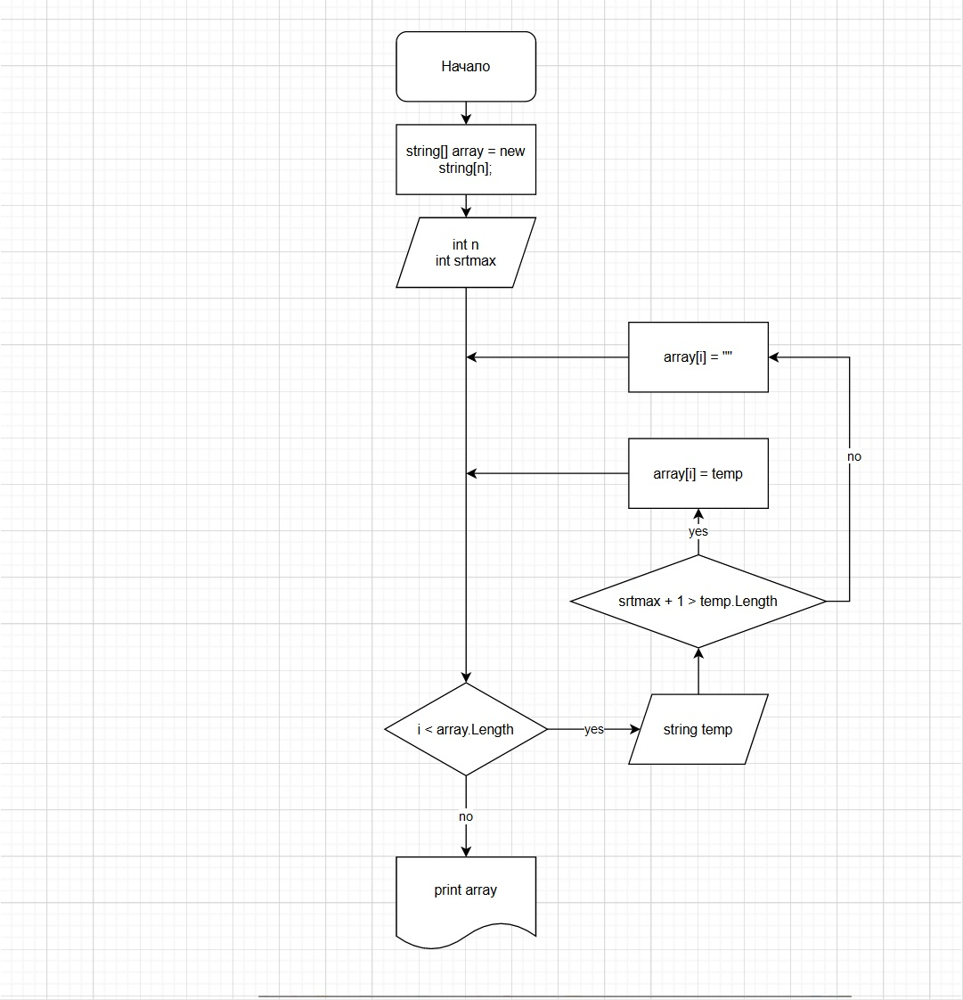

# Васкевич Сергей Александрович (финальная работа)

## Задача 
Написать программу, которая из имеющегося массива строк формирует массив строк, длинна которых больше либо равна 3 символа.
---

## Решение
1. Запрос от пользователя данных о длинее массива и максимального числа символов вводимых строках.
2. Обьявление массива в String.
3. Созданиен цикла For на запрос строк у пользователя с проверкой на допустимую длинну вводимой строки.
4. Вывод массива на экран.
---

## Блок схема.

---